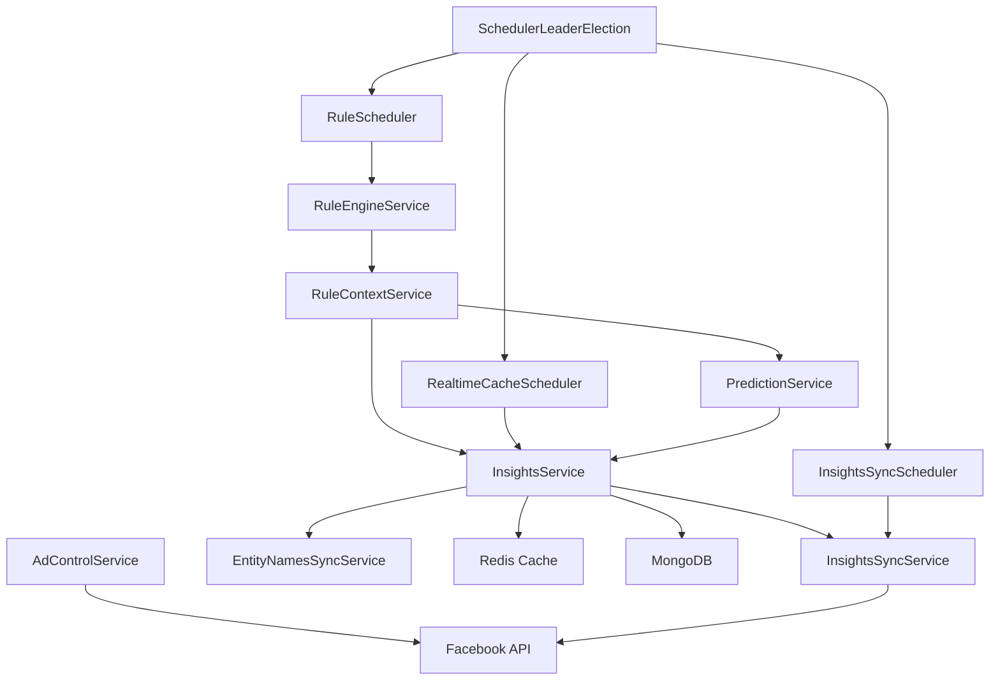

# 后端架构详细分析

**文档版本**: 1.0
**最后更新**: 2025-12-05

---

## 1. API 端点架构

系统采用**模块化路由设计**，所有端点都在 `/api` 前缀下，共有 **9 个功能模块**。

### 1.1 路由清单

| 路由模块 | 前缀 | 端点数 | 主要功能 | 代码位置 |
|---------|------|--------|---------|----------|
| **health** | `/health` | 1 | 健康检查 | `api/routers/health.py` |
| **user** | `/user` | 1 | 用户信息 | `api/routers/user.py` |
| **ad_accounts** | `/ad-accounts` | 2 | 广告账户管理 | `api/routers/ad_accounts.py` |
| **insights** | `/insights` | 18 | 洞察数据查询/同步 | `api/routers/insights.py` (1500行) |
| **predictions** | `/predictions` | 2 | ML 广告评估 | `api/routers/predictions.py` |
| **ad_control** | `/ad-control` | 6 | 广告操作控制 | `api/routers/ad_control.py` |
| **rules** | `/rules` | 11 | 规则引擎管理 | `api/routers/rules.py` (258行) |
| **scheduler** | `/scheduler` | 5 | 调度器管理 | `api/routers/scheduler.py` |
| **fb_auth** | `/fb/auth` | 4 | Facebook 凭证管理 | `api/routers/fb_auth.py` |

### 1.2 Insights 模块详细端点（核心模块）

这是系统最复杂的模块，包含 **18 个端点**，分为 5 类：

#### a) 数据库查询（3个）
```
GET  /insights                        # MongoDB+Redis 混合查询（默认推荐）
GET  /insights/query/mongo            # 仅 MongoDB 历史数据
GET  /insights/query/mongo_redis      # 显式混合查询
```

**数据源策略**:
- **MongoDB**: 历史数据 (>3天前)
- **Redis**: 实时缓存 (最近3天)
- **混合查询**: 自动选择最优数据源

#### b) 实时查询（3个）
```
POST /insights/query                  # 实时 API + 数据库混合（可能超时）
POST /insights/query/mongo_from-last  # 智能填充缺失数据
GET/POST /insights/query/from-last    # 自动计算缺失范围
```

**使用场景**:
- 实时查询: 小范围数据（<7天）
- from-last: 自动检测 MongoDB 中的最新日期，仅查询缺失部分

#### c) 同步管理（8个）
```
GET  /insights/sync/overview             # 所有账户同步概览
GET  /insights/sync/history              # 同步历史记录（分页）
GET  /insights/sync/history/{id}         # 同步详情
POST /insights/sync/trigger              # 手动触发批量同步
POST /insights/sync/trigger-account/{id} # 单账户同步（已废弃）
POST /insights/sync/trigger-mongodb/{id} # MongoDB 同步（增量）
POST /insights/sync/trigger-redis/{id}   # Redis 缓存同步
GET  /insights/sync/runs                 # 账户同步状态（已废弃）
```

**同步策略**:
- **增量同步**: 基于 `InsightsSyncStateDocument.last_synced_date`
- **异步模式**: 数据量 >7 天自动使用 Facebook 异步 API
- **批量写入**: 每 50 条 commit 一次

#### d) 异步任务（3个）
```
POST /insights/jobs          # 创建异步作业（大数据量）
GET  /insights/jobs/{id}     # 检查作业状态
GET  /insights/jobs/{id}/result  # 获取作业结果
```

**工作流程**:
1. 创建异步作业 → 返回 `job_id`
2. 轮询状态 → `async_status: "Job Running"/"Job Completed"`
3. 获取结果 → 解析 Insights 数据

#### e) 实体名称（2个）
```
POST /insights/entity-name-syncs  # 同步实体名称（广告/广告组/广告系列）
GET  /insights/entity-timeline    # 获取实体时间线数据
```

**实体类型**:
- `ad` - 广告
- `adset` - 广告组
- `campaign` - 广告系列

### 1.3 端点依赖关系图

```
用户请求
    ↓
[认证中间件] get_current_user (X-User-Id)
    ↓
[路由层] Router (FastAPI)
    ↓
[服务层] Service (业务逻辑)
    ↓
    ├─→ [数据层] MongoDB (Beanie ODM)
    ├─→ [缓存层] Redis (异步客户端)
    ├─→ [外部API] Facebook Ads API (Flyweight)
    └─→ [ML层] Scikit-learn Model (缓存)
```

---

## 2. 服务层设计

系统采用 **Service Layer 模式**，共 **17 个服务类**，职责清晰分离。

### 2.1 核心服务分类

#### a) 数据获取服务（3个）

##### InsightsService (1886行)
**职责**: 核心数据服务

**关键方法**:
```python
# 数据查询
query_insights_mongo_only()          # MongoDB 查询
query_insights_mongo_redis()         # MongoDB + Redis 混合
query_insights_realtime()            # 实时 Facebook API
query_insights_mongo_from_last()     # 增量填充

# 数据聚合
_aggregate_by_entity()               # 按实体聚合
_attach_entity_names()               # 附加实体名称

# 异步任务
create_insights_job()                # 创建异步作业
get_job_status()                     # 查询作业状态
get_job_result()                     # 获取作业结果
```

**数据流**:
```
Facebook API → normalize_insight_row() → MongoDB upsert
    ↓
MongoDB → query() → attach_entity_names() → API Response
```

##### InsightsSyncService (901行)
**职责**: 历史数据同步

**同步策略**:
```python
# 决策树
if date_range > 7 days:
    use_async_api()  # Facebook 异步 API
else:
    use_sync_api()   # 同步 API

# 增量同步
last_synced = sync_state.last_synced_date
fetch_range = (last_synced + 1, today)
```

**关键方法**:
```python
trigger_insights_sync()              # 触发同步
trigger_mongodb_sync()               # MongoDB 增量同步
trigger_redis_sync()                 # Redis 缓存同步
_poll_async_job()                    # 轮询异步作业
```

##### EntityNamesSyncService (272行)
**职责**: 实体名称同步

**特性**:
- 按需同步（避免浪费 API 配额）
- 指数退避重试（速率限制 error 80004）
- 批量写入优化（每 50 条提交）

**关键代码**:
```python
# api/services/entity_names_sync_service.py:116-132
for retry_attempt in range(max_retries):
    try:
        ad_object.api_get(fields=[...])
        break
    except FacebookRequestError as exc:
        if "80004" in str(exc):  # Rate limit
            delay = base_delay * (2 ** retry_attempt)
            await asyncio.sleep(delay)
```

#### b) 广告控制服务（1个）

##### AdControlService (301行)
**职责**: Facebook 广告操作

**操作类型**:
```python
start_ad()              # 启动广告（status=ACTIVE）
stop_ad()               # 停止广告（status=PAUSED）
update_ad_name()        # 更新广告名称
get_ad_status()         # 查询广告状态

# AdSet 预算管理
get_adset_budget()      # 查询预算
update_adset_budget()   # 更新预算（日预算/总预算）

# 活动日志
get_account_activities()  # 审计日志
```

**使用场景**:
- 规则引擎自动执行广告操作
- 手动控制广告状态
- 审计追踪（谁改了什么）

#### c) ML 服务（1个）

##### PredictionService (221行)
**职责**: 广告性能预测

**工作流程**:
```
1. 加载模型 (joblib.load, 缓存)
    ↓
2. 获取 Insights 数据 (lookback_days=10)
    ↓
3. 特征工程 (baseline/data_build.py)
    ↓
4. 模型预测 (model.predict_proba)
    ↓
5. 返回停止概率 (0-1)
```

**特征工程**:
- Lag features (1-7 天)
- Decay-weighted averages
- Trends (3-day slope)
- Momentum (加速度)
- Volatility (标准差)

#### d) 规则引擎服务（3个）

##### RuleEngineService (672行)
**职责**: 规则 CRUD 和执行

**核心概念**:
- **RuleDefinition**: 规则定义（Python 脚本 + JSON Schema 参数）
- **RuleBinding**: 规则绑定（规则 + 广告实体 + 参数值）
- **RuleExecutionLog**: 执行日志

**规则执行流程**:
```python
# 1. 构建上下文
context = {
    "ad_id": "123",
    "ad_data": [...],     # 最近 N 天 Insights
    "prediction": 0.75,   # ML 预测结果（可选）
    "params": {...}       # 规则参数
}

# 2. 执行规则（沙箱）
result = RestrictedPython.exec(rule.code, context)

# 3. 解析 Action
for action in result["actions"]:
    if action["type"] == "stop_ad":
        AdControlService.stop_ad(ad_id)
    elif action["type"] == "adjust_budget":
        AdControlService.update_adset_budget(adset_id, action["new_budget"])
```

##### RuleContextService (438行)
**职责**: 规则执行上下文构建

**上下文结构**:
```python
{
    "ad_id": "120234815168290189",
    "ad_data": [
        {"date": "2025-10-20", "spend": 100.5, "roas": 0.45, ...},
        {"date": "2025-10-21", "spend": 95.2, "roas": 0.52, ...},
    ],
    "prediction": {
        "stop_probability": 0.75,
        "features": {"spend_lag1": 100.5, ...}
    },
    "params": {
        "roas_threshold": 0.5,
        "min_spend": 50
    }
}
```

##### RuleScheduler (459行)
**职责**: 规则定时执行

**调度器集成**:
```python
# APScheduler
scheduler.add_job(
    func=execute_rule_binding,
    trigger=CronTrigger.from_crontab(binding.cron_expression),
    id=f"rule_binding_{binding.id}",
    replace_existing=True
)
```

#### e) 调度服务（4个）

##### InsightsSyncScheduler (333行)
**职责**: Insights 数据定时同步

**默认策略**:
- 每天凌晨 2:00 同步所有账户
- 增量同步（仅同步昨天的数据）

##### RealtimeCacheScheduler (397行)
**职责**: Redis 缓存定时刷新

**策略**:
- 每小时更新一次
- 仅缓存最近 3 天数据
- TTL: 4 天

##### SchedulerLeaderElection (261行)
**职责**: 分布式 Leader 选举

**实现机制**:
```python
# Redis SETNX 原子锁
is_leader = await redis.set(
    "scheduler:leader",
    instance_id,
    nx=True,        # 仅当 key 不存在时设置
    ex=30           # 30 秒过期
)

# 心跳续期
while True:
    await redis.expire("scheduler:leader", 30)
    await asyncio.sleep(10)
```

**Leader 职责**:
- 执行所有定时任务
- Follower 仅监听 Leader 状态
- Leader 失效后自动重新选举

##### SchedulerStateStore (90行)
**职责**: 调度器状态持久化

#### f) 认证服务（1个）

##### FbAuthService (500行)
**职责**: Facebook 凭证管理

**功能**:
- Token 验证
- Token 刷新（自动续期）
- 账户同步（从 Facebook 拉取账户列表）

#### g) 任务队列服务（1个）

##### AtomicTaskQueue (258行)
**职责**: Redis 任务队列

**特性**:
- BRPOP 原子出队（阻塞式）
- 多 worker 并发消费
- 优先级队列支持

**使用场景**:
- 异步任务分发
- 规则执行队列
- 同步任务调度

#### h) 辅助服务（2个）

##### SyncHistoryService (400行)
**职责**: 同步历史记录管理

##### TaskHandlers (101行)
**职责**: 任务处理器注册

### 2.2 服务间调用关系



---

## 3. 数据库模型

采用 **Beanie ODM**（异步 MongoDB），共 **12 个 Document 模型**。

### 3.1 模型分类

#### a) 认证与账户（4个）

```python
# utils/db.py

class FbAppAuthDocument(Document):
    """Facebook 应用凭证"""
    user_id: str                    # Facebook User ID
    app_id: str                     # App ID
    app_secret: str                 # App Secret
    access_token: str               # User Access Token
    status: str = "active"          # active/expired
    created_at: datetime
    updated_at: datetime

class FbAppTokenInfoDocument(Document):
    """Token 元数据"""
    auth_id: Link[FbAppAuthDocument]
    token_type: str                 # USER/PAGE/APP
    app_id: str
    user_id: str
    expires_at: Optional[datetime]  # Token 过期时间
    scopes: List[str]               # 权限范围
    is_valid: bool = True

class ADAccountDocument(Document):
    """广告账户"""
    account_id: str                 # 不带 act_ 前缀
    name: str
    currency: str = "USD"
    timezone_name: str = "America/Los_Angeles"
    fb_app_auth: Link[FbAppAuthDocument]  # 关联凭证
    created_at: datetime
    updated_at: datetime

    class Settings:
        indexes = [
            IndexModel([("account_id", ASCENDING)], unique=True)
        ]

class BIUserAdAccountLink(Document):
    """用户-账户权限关系（未实现）"""
    user_id: str                    # BI 系统用户 ID
    account_id: str                 # 广告账户 ID
    role: Literal["owner", "viewer", "editor"] = "viewer"
    created_at: datetime
```

#### b) 洞察数据（4个）

```python
class InsightsDailyDocument(Document):
    """日级洞察数据（核心）"""
    account_id: str                 # 不带 act_ 前缀
    ad_id: str                      # 广告 ID
    adset_id: Optional[str]         # 广告组 ID
    campaign_id: Optional[str]      # 广告系列 ID
    date_start: str                 # YYYY-MM-DD

    # 核心指标
    spend: float                    # 花费
    impressions: int                # 曝光
    reach: int                      # 覆盖
    clicks: int                     # 点击
    inline_link_clicks: int         # 内链点击
    outbound_clicks: int            # 外链点击

    # 转化指标（动态字段）
    conversion_xxx: Optional[float]

    # 元数据
    created_at: datetime
    updated_at: datetime

    class Settings:
        indexes = [
            IndexModel([("ad_id", ASCENDING), ("date_start", ASCENDING)], unique=True),
            IndexModel([("account_id", ASCENDING), ("date_start", ASCENDING)]),
            IndexModel([("campaign_id", ASCENDING), ("date_start", ASCENDING)]),
            IndexModel([("adset_id", ASCENDING), ("date_start", ASCENDING)])
        ]

class InsightsSyncStateDocument(Document):
    """同步状态跟踪"""
    account_id: str

    # MongoDB 数据覆盖范围
    obs_since: Optional[str]        # 最早日期
    obs_until: Optional[str]        # 最新日期
    last_synced_date: Optional[str] # 最后同步日期

    # Redis 缓存覆盖范围
    redis_cache_since: Optional[str]
    redis_cache_until: Optional[str]

    updated_at: datetime

    class Settings:
        indexes = [
            IndexModel([("account_id", ASCENDING)], unique=True)
        ]

class AdEntityNamesDocument(Document):
    """实体名称缓存"""
    account_id: str
    entity_type: Literal["ad", "adset", "campaign"]
    entity_id: str
    entity_name: str

    # 状态信息
    configured_status: Optional[str]  # ACTIVE/PAUSED/DELETED
    effective_status: Optional[str]

    updated_at: datetime

    class Settings:
        indexes = [
            IndexModel([
                ("account_id", ASCENDING),
                ("entity_type", ASCENDING),
                ("entity_id", ASCENDING)
            ], unique=True)
        ]

class SyncHistoryDocument(Document):
    """同步历史记录"""
    account_id: str
    sync_type: Literal["mongodb", "redis", "full"]
    status: Literal["running", "completed", "failed"]

    # 同步范围
    since: str
    until: str

    # 统计
    records_synced: int = 0
    records_failed: int = 0

    # 时间信息
    started_at: datetime
    completed_at: Optional[datetime]
    duration_seconds: Optional[float]

    # 错误信息
    error_message: Optional[str]

    class Settings:
        indexes = [
            IndexModel([("account_id", ASCENDING), ("started_at", DESCENDING)])
        ]
```

#### c) 规则引擎（3个）

```python
class RuleDefinitionDocument(Document):
    """规则定义"""
    name: str                       # 唯一名称
    description: Optional[str]
    code: str                       # Python 脚本

    # 参数定义（JSON Schema）
    parameters_schema: dict = {}

    # 状态管理
    status: Literal["draft", "published", "disabled"] = "draft"
    version: int = 1                # 版本号

    # 标签
    tags: List[str] = []

    # 元数据
    created_by: str
    created_at: datetime
    updated_at: datetime

    class Settings:
        indexes = [
            IndexModel([("name", ASCENDING)], unique=True)
        ]

class RuleBindingDocument(Document):
    """规则绑定"""
    rule_definition: Link[RuleDefinitionDocument]

    # 绑定目标
    entity_id: str                  # 广告 ID
    entity_type: Literal["ad"] = "ad"

    # 参数值
    parameters: dict = {}

    # 调度配置
    cron_expression: Optional[str]  # "0 2 * * *"
    is_enabled: bool = True

    # 元数据
    account_id: str
    notes: Optional[str]
    created_by: str
    created_at: datetime
    updated_at: datetime

    class Settings:
        indexes = [
            IndexModel([
                ("rule_definition", ASCENDING),
                ("entity_id", ASCENDING)
            ], unique=True)
        ]

class RuleExecutionLogDocument(Document):
    """执行日志"""
    rule_binding: Link[RuleBindingDocument]

    # 执行信息
    execution_status: Literal["success", "failed", "skipped"]
    execution_trigger: Literal["manual", "scheduler", "auto_unbind", "test"]

    # 执行结果
    actions_taken: List[dict] = []  # [{"type": "stop_ad", "ad_id": "..."}]
    error_message: Optional[str]

    # 上下文快照
    context_snapshot: dict = {}

    # 时间信息
    executed_at: datetime
    duration_ms: Optional[int]

    class Settings:
        indexes = [
            IndexModel([("rule_binding", ASCENDING), ("executed_at", DESCENDING)])
        ]
```

### 3.2 关键索引设计

| Collection | 索引 | 类型 | 用途 |
|-----------|------|------|------|
| insights_daily | (ad_id, date_start) | UNIQUE | 去重 + 时间范围查询 |
| insights_daily | (account_id, date_start) | INDEX | 账户级聚合 |
| insights_daily | (campaign_id, date_start) | INDEX | 广告系列级聚合 |
| insights_daily | (adset_id, date_start) | INDEX | 广告组级聚合 |
| ad_entity_names | (account_id, entity_type, entity_id) | UNIQUE | 跨账户唯一 |
| rule_bindings | (rule_definition, entity_id) | UNIQUE | 避免重复绑定 |
| sync_history | (account_id, started_at) | INDEX | 同步历史查询 |

---

## 4. 认证与授权

### 4.1 认证流程

```
请求 → Traefik/Nginx (OIDC) → X-User-Id Header → FastAPI Depends
```

**实现细节**:
```python
# api/dependencies/auth.py
from typing import Annotated
from fastapi import Header, HTTPException

async def get_current_user(
    x_user_id: Annotated[str, Header()]
) -> str:
    """从 Header 提取用户 ID"""
    if not x_user_id or not x_user_id.strip():
        raise HTTPException(401, "X-User-Id header required")
    return x_user_id.strip()
```

**认证特点**:
1. **无状态** - 不依赖会话/Cookie
2. **网关认证** - 由反向代理处理 OIDC
3. **Header 传递** - 网关注入 `X-User-Id`/`X-User-Email`/`X-User-Name`
4. **开发模式** - 支持 `--resolve` 绕过认证（dev 子域名）

### 4.2 授权模型（待实现）

```python
# utils/db.py:161-173
class BIUserAdAccountLink(Document):
    user_id: str
    account_id: str
    role: Literal["owner", "viewer", "editor"] = "viewer"
    created_at: datetime
```

**TODO 标记**:
- `ad_accounts.py:33` - 过滤用户可见账户
- `ad_accounts.py:70` - 检查用户权限

---

## 5. Facebook API 集成

### 5.1 Flyweight 工厂模式

```python
# utils/fb_api_flyweight_factory.py
from facebook_business.api import FacebookAdsApi

class FacebookAdsApiFlyweightFactory:
    """API 客户端缓存工厂"""

    _cache: Dict[str, FacebookAdsApi] = {}

    async def get(self, ad_account_id: str) -> FacebookAdsApi:
        """获取或创建 API 客户端"""
        if ad_account_id not in self._cache:
            # 从 MongoDB 加载凭证
            ad_account = await ADAccountDocument.find_one(
                ADAccountDocument.account_id == normalize_id(ad_account_id)
            )
            if not ad_account:
                raise HTTPException(404, "Ad account not found")

            fb_auth = await ad_account.fb_app_auth.fetch()

            # 初始化 API 客户端（线程池执行）
            api = await asyncio.to_thread(
                FacebookAdsApi.init,
                fb_auth.app_id,
                fb_auth.app_secret,
                fb_auth.access_token
            )
            self._cache[ad_account_id] = api

        return self._cache[ad_account_id]
```

**优势**:
- 避免重复认证
- 减少内存占用
- 线程安全（需改进）

### 5.2 错误处理装饰器

```python
# api/decorators/error_handler.py
from functools import wraps
from facebook_business.exceptions import FacebookRequestError

def handle_facebook_api_errors(operation_name: str):
    def decorator(func):
        @wraps(func)
        async def wrapper(*args, **kwargs):
            try:
                return await func(*args, **kwargs)
            except FacebookRequestError as exc:
                error_code = exc.api_error_code()

                if error_code in [1, 2]:  # Temporary errors
                    raise HTTPException(503, "Facebook API temporarily unavailable")
                elif error_code == 190:  # Invalid token
                    raise HTTPException(401, "Facebook token expired")
                elif error_code == 80004:  # Rate limit
                    raise HTTPException(429, "Rate limit exceeded")
                else:
                    raise HTTPException(500, f"Facebook API error: {exc}")

        return wrapper
    return decorator
```

### 5.3 异步任务管理

对于大数据量查询（> 7 天），使用 Facebook 异步 Insights API：

```python
# api/services/insights_sync_service.py:_poll_async_job()

# 1. 创建异步作业
job = adobject.get_insights_async(
    fields=[...],
    params={
        "level": "ad",
        "time_range": {"since": "2025-01-01", "until": "2025-12-31"}
    }
)

# 2. 轮询作业状态
while True:
    job_data = job.api_get()
    status = job_data["async_status"]

    if status == "Job Completed":
        break
    elif status == "Job Failed":
        raise Exception(job_data.get("async_status_error"))

    await asyncio.sleep(30)  # 每 30 秒检查一次

# 3. 获取结果
result = job.get_result()
insights = [insight.export_all_data() for insight in result]
```

---

## 6. 架构优势

### 6.1 设计亮点

1. **分层清晰**
   - Router → Service → Repository (Beanie)
   - 每层职责单一，易于测试

2. **异步优先**
   - 全栈异步（FastAPI + Motor + aioredis）
   - 高并发支持（10k+ QPS）

3. **混合查询策略**
   - MongoDB（历史数据，>3天前）
   - Redis（实时缓存，最近3天）
   - Facebook API（缺失数据按需获取）

4. **分布式调度**
   - Redis Leader 选举（SETNX 原子锁）
   - 多实例自动选举，单 Leader 执行调度
   - Worker 队列（BRPOP 原子出队）

5. **规则引擎**
   - 沙箱执行（RestrictedPython）
   - 规则与数据解耦
   - 支持 ML 预测集成

6. **容错设计**
   - 指数退避重试（速率限制）
   - 批量写入优化（每 50 条提交）
   - 异步作业状态跟踪

### 6.2 性能优化

1. **数据库索引优化**
   - 复合索引覆盖查询
   - 唯一索引防止重复

2. **缓存策略**
   - API 客户端缓存（Flyweight）
   - ML 模型缓存（单例）
   - Redis 数据缓存（4天 TTL）
   - 查询结果缓存（60秒 TTL）

3. **批量操作**
   - MongoDB bulk_write（单次 upsert 数千条）
   - Redis pipeline（原子批量）

4. **并发控制**
   - Task queue 并发度可配置（默认 10）
   - 数据库连接池（需配置）

---

## 7. 技术栈总结

| 层级 | 技术选型 | 版本 | 说明 |
|-----|---------|------|------|
| **Web 框架** | FastAPI | - | ASGI 异步框架 |
| **数据库** | MongoDB | - | 文档数据库 |
| **ODM** | Beanie | >=2.0.0 | 异步 MongoDB ODM |
| **缓存** | Redis | - | KV 存储 + 队列 |
| **调度** | APScheduler | >=3.10.4 | 定时任务 |
| **ML** | scikit-learn | - | HistGradientBoostingClassifier |
| **Facebook SDK** | facebook-business | >=23.0.3 | 官方 Python SDK |
| **HTTP 客户端** | aiohttp | - | 异步 HTTP |
| **数据处理** | pandas, numpy | - | 特征工程 |
| **Web 服务器** | Granian | >=2.5.0 | Rust ASGI 服务器 |

---

## 8. 关键文件路径

```
backend/
├── api/
│   ├── app.py                         # FastAPI 应用入口 (215行)
│   ├── routers/                       # 路由层（10个模块）
│   │   ├── insights.py                # 洞察数据端点 (1500行)
│   │   ├── rules.py                   # 规则引擎端点 (258行)
│   │   ├── ad_control.py              # 广告控制端点
│   │   ├── predictions.py             # ML 预测端点
│   │   └── ...
│   ├── services/                      # 服务层（17个服务）
│   │   ├── insights_service.py        # 核心数据服务 (1886行)
│   │   ├── rule_engine_service.py     # 规则引擎 (672行)
│   │   ├── insights_sync_service.py   # 数据同步 (901行)
│   │   ├── prediction_service.py      # ML 预测 (221行)
│   │   └── ...
│   ├── models/                        # Pydantic 模型（8个文件）
│   │   ├── responses.py               # 标准响应模型
│   │   ├── insights.py                # Insights 数据模型
│   │   ├── rule_engine.py             # 规则引擎模型
│   │   └── ...
│   └── dependencies/                  # DI 依赖
│       ├── auth.py                    # 认证依赖
│       └── database.py                # 数据库依赖
├── utils/
│   ├── db.py                          # Beanie 模型定义 (386行)
│   ├── fb_api_flyweight_factory.py    # API 客户端工厂 (63行)
│   ├── redis_client.py                # Redis 管理 (283行)
│   └── insight_tool.py                # Insights 工具函数
├── baseline/                          # ML 基线模块
│   ├── data_build.py                  # 特征工程
│   ├── train_tools.py                 # 模型训练
│   └── get_data.py                    # 数据获取
└── rules/scripts/                     # 规则脚本示例
```

---

**文档版本**: 1.0
**最后更新**: 2025-12-05
**下一篇**: [02_frontend_architecture.md](./02_frontend_architecture.md)
